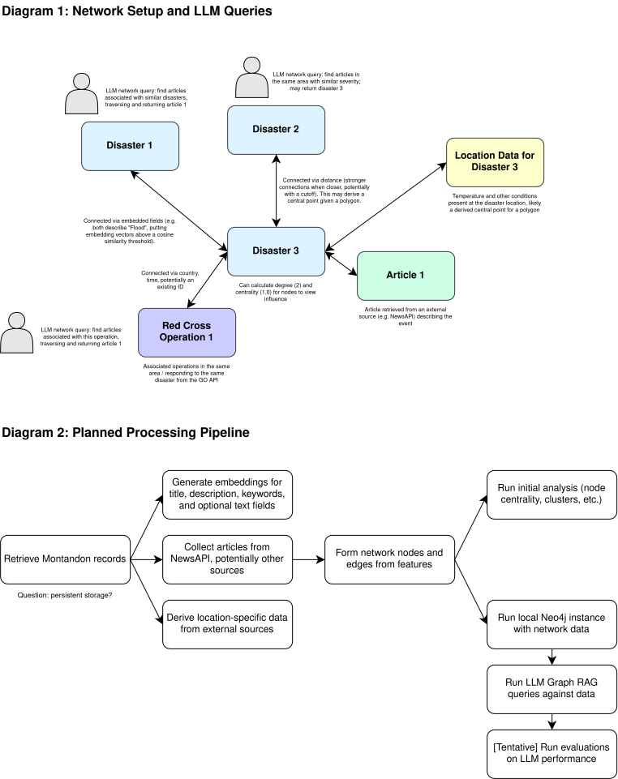

# Capstone Proposal
## Exploring applications for the Montandon Global Crisis Data Bank
### Proposed by: Jeongmin An, Jehan Bugli, and Aidan Carlisle
#### Email: zds6799@gmail.com, jehan.bugli@gwmail.gwu.edu, aidan.carlisle@gwmail.gwu.edu
#### Advisor: Amir Jafari
#### The George Washington University, Washington DC
#### Data Science Program

## 1 Objective:

The International Federation of Red Cross (IFRC) has created Montandon, the world's largest
disaster database. This includes information on disasters, their impacts, and operational responses.
The goal of this project is to explore potential applications of this database to improve disaster understanding and response readiness, building a proof-of-concept pipeline for at least one such application in conjunction with Red Cross stakeholders.

Key Objectives:
1. Build network representations of disasters and responses using existing and generated features.
  - Generated features include:
    - Embeddings for certain text fields, including titles, descriptions and key words
    - External data connections, including articles surrounding disasters and temperature at disaster locations. This includes:
      - [NewsAPI](https://newsapi.org/)
2. Explore the generated network to develop interpretable takeaways, such as:
    - Identifying disaster node clusters, central nodes, and other network science measures ([networkx](https://networkx.org/en/) clustering, node centrality)
    - Integrating the network with an LLM to run queries and provide recommendations (local [Neo4j](https://neo4j.com/product/community-edition/), LLM tool calls coverted to Cypher)
4. Develop a proof-of-concept tool for Red Cross stakeholders to use with the full data bank as new disasters are added

*Figure 1: This diagram includes planned network dynamics and rough data processing stages.*

## 2 Dataset:

This project centers around the [Montandon Global Crisis Data Bank](https://montandondata.org/),
which has restricted access ahead of a production release (requiring an IFRC GO account for API use).

The data bank uses a modified version of the [SpatioTemporal Asset Catalogs (STAC) specification](https://stacspec.org/en),
including added custom fields and aggregating information from multiple sources.

The [Sentence Transformers](https://sbert.net/) library is the likely target for embedding exploration,
with models like (all-MiniLM-L6-v2](https://huggingface.co/sentence-transformers/all-MiniLM-L6-v2)
available on HuggingFace.

DATASET / PIPELINE PREPARATION:
- Build shared utilities for retrieving Montandon API data
- Build utilities for interfacing with other external data sources, like the following (tentatively):
  - [NewsAPI](https://newsapi.org/): articles related to disasters
  - [NASA POWER](https://power.larc.nasa.gov/): weather at disaster locations
  - [IFRC GO API](https://go-wiki.ifrc.org/en/go-api/api-overview): Red Cross operational data
- Use Pydantic to construct a shared schema for API data to support static type safety
- Potentially build related utilities around a cloud bucket to store previously retrieved records
  depending on desired API use patterns

## 3 Rationale:

The Red Cross plays a critical role in global disaster responses. This project provides the
opportunity to bridge a gap between their extensive data bank and their ability to use it,
making it both technically interesting and impactful. The data bank's range of features
provides the opportunity to exercise a variety of potential approaches.

WHY THIS PROJECT IS TIMELY:
[Weather-related disasters are increasing in frequency and severity](https://www.climatecentral.org/climate-matters/billion-dollar-disasters-2025),
costing many lives and causing immense economic damage. Because of this, the need to understand disaster dynamics
and organizational responses grows proportionally. This project can make a meaningful contribution to
this space by helping the Red Cross glean insights from stored data.

## 4 Approach:

PHASE 1: DATA ACCESS & SHARED FOUNDATION (Week 1)

[Week 1: Data Access, Scoping & Shared Setup]
- Meet with Red Cross stakeholders to confirm handling restrictions and understand insight gaps
- Build shared API data retrieval and parsing utilities
- Complete repository setup chores, like CI, project setup, and more

PHASE 2: EXPLORATORY FEATURE GENERATION & INITIAL REPORTING (Weeks 2-4)

[Week 2: First Feature Pipelines]
- Student 1: Explore external news reporting integration with Montandon records
- Student 2: Run initial exploratory data analysis on the full Montandon record set
- Student 3: Build an embedding pipeline for descriptions and keywords, starting work on clustering

[Week 3: Storage & Network Drafting]
- Complete any lingering feature generation pipeline work or associated refinement with Montandon records
- Create utilities to construct network graphs, likely using local Neo4j as a baseline
- Refine and complete external news reporting retrieval (NewsAPI, etc.), integrating that into the network
- Build pipeline for weather data retrieval, integrating that into the network

[Week 4: Initial Reporting & Network Design]
- Complete network graph utilities
- Build initial reporting pipelines to derive insights from network science measures
  - Generate initial exploratory plots and takeaways
- Sync with Red Cross stakeholders on decisions/direction

PHASE 3: NETWORK ANALYSIS & REPORTING TOOLS (Weeks 5-8)

[Week 5: Initial LLM integration]
- Build utilities for Huggingface LLM integration, including a [chat template](https://huggingface.co/docs/transformers/main/en/internal/tokenization_utils#transformers.PreTrainedTokenizerBase.apply_chat_template) with tools for Cypher queries
  - This may involve non-Cypher tools or other approaches depending on findings
- Complete network(s) that the LLM will use as the platform for queries

[Week 6: LLM testing and network completion]
- Refine network maps as needed for tool calls
- Test LLM recommendations, creating a fact retrieval benchmark to compare LLM efficacy and tool call behavior
- Draft report on initial findings

[Week 7: Network Reporting]
- Draft the first complete reports for the full network setup and LLM integration
- Sync with Red Cross stakeholders on initial findings and proof-of-concept direction

PHASE 4: PROOF OF CONCEPT, EVALUATION & PAPER WORK (Weeks 8-12)

[Weeks 8-10: Complete the Proof of Concept]
- Build a proof-of-concept tool/pipeline, extending on existing work for more concrete Red Cross utility
  - Potentially could be distributed as a Python library or a separate repository
- Test on data bank records
- Begin organizing the paper around the investigation process, methods, and initial findings

[Week 11: Revision & Paper Work]
- Revise the proof-of-concept based on Red Cross stakeholder feedback
- Document what works, what does not work, data limitations, and reasonable next steps to extend on the concept
- Prepare final figures, results, and code needed for the paper
- Complete a full draft of the paper documenting the investigation process and findings

[Week 12: Paper Completion & Submission]
- Revise and submit the project paper
- Start preparing the remaining final deliverables for the Red Cross

PHASE 5: FINAL HANDOFF (Weeks 13-15)

[Week 13: Final Analysis & Deliverable Preparation]
- Complete any remaining analysis and finalize limitations and next-step recommendations
- Prepare the final proof-of-concept materials and supporting documentation

[Week 14: Final Documentation]
- Finalize all deliverables for the Red Cross

[Week 15: Presentation & Handoff]
- Hand off the proof-of-concept completely, along with associated Red Cross correspondence
- Complete the final presentation and final project tweaks for submission.

## 5 Timeline:

Week 1:  Confirm handling restrictions and stakeholder questions; build shared API retrieval and
  parsing utilities, then complete repository setup.
Week 2:  Start NewsAPI work, run exploratory analysis on the Montandon data, and begin embeddings.
Week 3:  Continue the feature work, build graph utilities, and add external data to Montandon records.
Week 4:  Build reports and plots from the first results; complete the graph utilities and meet with
  Red Cross stakeholders on findings and direction.
Week 5:  Build Hugging Face LLM utilities, including tools for Cypher queries; complete the network
  setup the LLM will query.
Week 6:  Test LLM tool calls and recommendations with a fact retrieval benchmark; update the network
  maps as needed and draft a report on the findings.
Week 7:  Draft reports on the network and LLM work; meet with Red Cross stakeholders on findings and
  the proof-of-concept direction.
Week 8:  Start the proof-of-concept tool or pipeline, test it on data bank records, and begin the paper.
Week 9:  Continue the proof of concept and draft the paper's methods, findings, and limitations.
Week 10: Complete the first proof-of-concept version and the first full paper draft.
Week 11: Revise the proof of concept from stakeholder feedback; complete figures, results, and
  paper revisions.
Week 12: Submit the completed research paper; document follow-up work and begin final deliverable preparation.
Week 13: Complete remaining analysis, limitations, and next steps; prepare final materials.
Week 14: Finalize all Red Cross deliverables and repository documentation.
Week 15: Complete the final presentation and handoff of the proof of concept, reporting tools, and
  associated Red Cross correspondence.

TOTAL: 15 weeks

KEY MILESTONES:
- Week 1:  Shared data access and working project foundation complete
- Week 4:  Reports, plots, and graph utilities complete
- Week 7:  Network and LLM reports complete; proof-of-concept direction confirmed
- Week 10: Working proof of concept plus complete internal paper draft
- Week 12: Project paper submitted
- Week 15: Final handoff complete

DELIVERABLES BY WEEK 15:
- Reusable data retrieval, cleaning, and feature-generation pipeline
- News, exploratory analysis, and embedding outputs
- Disaster and response network analysis and reporting
- Reusable network generation, reporting, and visualization tools
- LLM integration and fact retrieval evaluation results
- Proof-of-concept tool or pipeline providing utility to Red Cross stakeholders
- Project paper submission
- Final report, presentation, and documented repository

## 6 Expected Number Students:

RECOMMENDED: 3 students

SHARED RESPONSIBILITIES (all students):
- Data retrieval, schema decisions, cleaning, documentation, stakeholder meetings,
proof-of-concept design, testing, writing, and the final presentation.

ROLE DISTRIBUTION FOR 3 STUDENTS:

Student 1: NewsAPI & External Data
- Explore NewsAPI and related sources for articles surrounding disasters.
- Build the work needed to connect external data to Montandon records.

Student 2: Exploratory Analysis
- Explore the Montandon record set, identifying limitations and retrieval issues.
- Scope out useful geospatial data integrations and handle connections to external
  sources via these relationships (e.g. temperature),

Student 3: Embeddings & Clustering
- Generate text embeddings for titles, descriptions, and keywords; explore clustering.
- Prepare embedding outputs for network construction and LLM queries.
- Prepare initial network construction utilities.

All Students:
- Construct tools for LLM use
- Support testing and review
- Write reports analyzing data through a network science lens and LLM integration dynamics
- Communicate with Red Cross stakeholders
- Produce final paper and deliverables for the Red Cross

## 7 Possible Issues:

TECHNICAL CHALLENGES AND SOLUTIONS:

1. Restricted API Access or Changing Fields:
- ISSUE: Access patterns and available fields may change while the data bank is still being released.
- SOLUTION: Work with Red Cross stakeholders to triage potentially unreliable features

2. Missing or Inconsistent Data:
- ISSUE: Locations, dates, descriptions, and response fields may be incomplete or inconsistent,
  especially given that this is aggregated from many different sources.
- SOLUTION: Profile missing data early on and ensure that takeaways are broad/robust enough.

3. Network Definitions:
- ISSUE: Network node/edge decisions can be somewhat opinioned/arbitrary, leading to different results.
- SOLUTION: Test multiple variations and defer to Red Cross stakeholders for utility determinations.

4. Scope of the Final Proof of Concept:
- ISSUE: There may be more possible applications than can be completed in one semester.
- SOLUTION: Work with Red Cross stakeholders to build something with concrete utility
  that they can extend upon moving forward.

RISK MITIGATION TIMELINE:
- Week 1:  Confirm access, handling rules, data availability, and the stakeholder questions.
- Weeks 2-4: Check feature outputs against the source data and document coverage and limitations.
- Week 5:  Review network plans with stakeholders before building out both network analyses.
- Week 9:  Lock the proof-of-concept scope.
- Weeks 10-12: Test the proof of concept and revise it from stakeholder feedback.
- Weeks 13-15: Final documentation review and careful handoff of approved outputs.

## Contact
- Author: Amir Jafari
- Email: [ajafari@gwu.edu](mailto:ajafari@gwu.edu)
- GitHub: 
